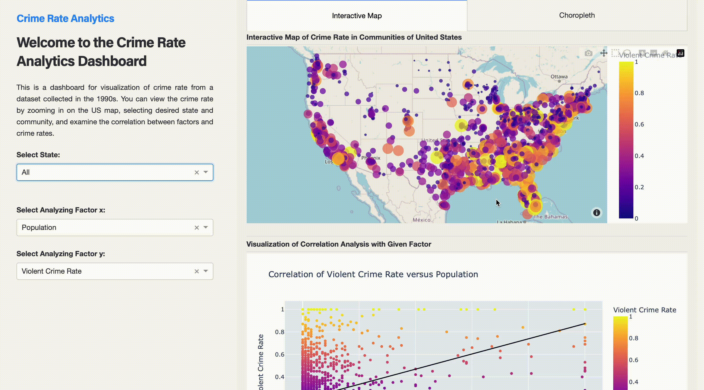

# Vancouver Crime Dashboard
Link to the dashboard: [Crime Dashboard](https://crime-dash.onrender.com)

## Motivation
The crime rate in a community is an important factor that citizens consider when making decisions about whether to live or invest. A high crime rate in a city may impact personal safety, property values, and overall quality of life and is influenced by many factors. Understanding where, how and why crime happens is important for fighting and lowering crime rates, hence increasing safety in communities. Since 1930, the FBI has been collecting data on the types, amounts, and impact of crime in the United States through the Uniform Crime Reporting Program. So, our dashboard will aim to figure out the socioeconomic conditions, socio-demographic and community factors influencing crime rates in different US states as well as provide access to crime data in an understandable and intuitive manner.

A proposal with a persona can be found [here](reports/proposal.md), describing example usage scenarios and functionality.

## Description of the Dashboard

This interactive visualization and exploration tool will contain an interactive map as a landing page that will show the violent crimes committed in the Continental United States of America by State and County.

The following steps illustrate how the user could interact with the dashboard using the link on top or locally:

- Entering the main page of the dashboard, you can see one interactive map showing all communities and their associated crime rate. At the bottom right you can see a scatter plot showing the correlation between two selected factors.



- The left-hand filter controls which state the user wants to specifically look into. Here we can type California to display communities that are only in this state.


- Using the interactive map, the user can further scroll and zoom in to inspect the cities if the data is concentrated.


- The filters on the bottom left are controlling what two factors to compare in the scatter plot. By default, we want to investigate the factors correlated to crime rate. We can try different factors on the x-axis to compare.


- We also have a choropleth on the top left illustrating a summarized state crime rate by taking the averages of the communities. We can hover over different states to see the summarized result.


## How to run this app

### Requirements

* Python 3.10+

We suggest you to create a virtual environment for running this app with Python 3.10. Clone this repository 
and open your terminal/command prompt in the root folder.

```
git clone https://github.com/lukeyf/crime_dash.git
cd crime_dash
python3 -m virtualenv venv
```

Install all required packages by running:
```
pip install -r requirements.txt
```

Run this app locally with:
```
python app.py
```


### Contributing

Contributor:

 <a href="https://github.com/UBC-MDS/chembox/graphs/contributors">
  
</a>

Interested in contributing? Check out the contributing guidelines.

We would love to know what other datasets we can bring into our dashboard to make it more useful. Please also feel free to offer suggestions on other interactive options you'd like to see.

Please note that this project is released with a [Code of Conduct](CODE_OF_CONDUCT). By contributing to this project, you agree to abide by its terms.

### License

This dashboard was created by Luke Yang.

It is licensed under the terms of the MIT license.